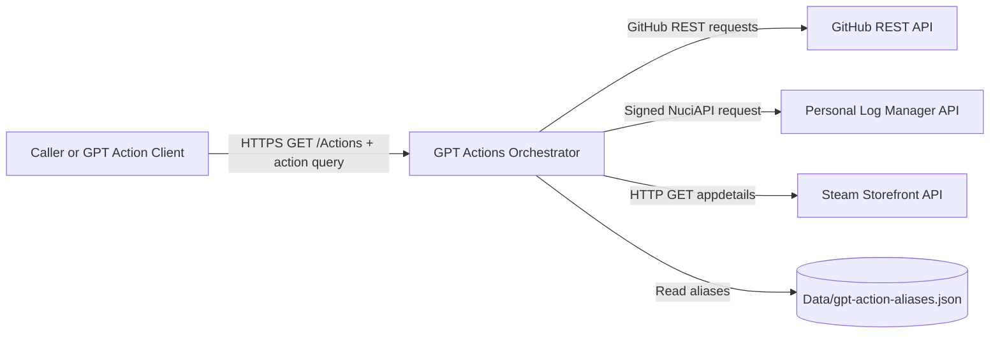
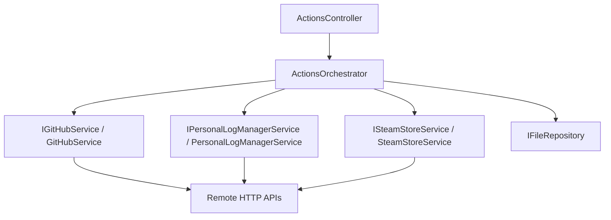
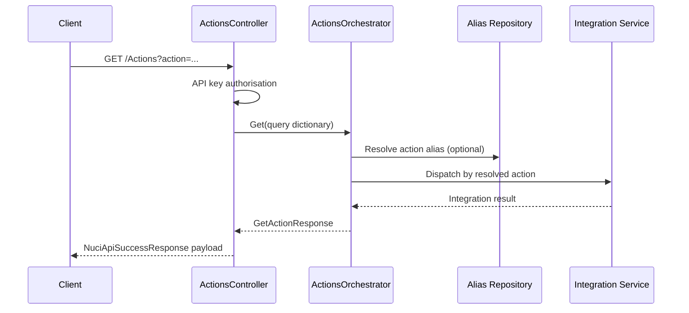
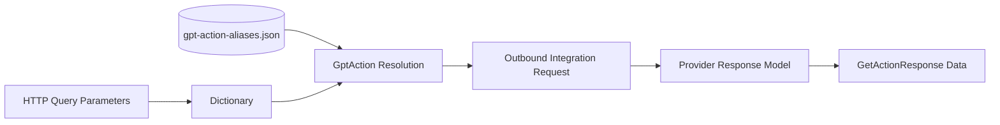
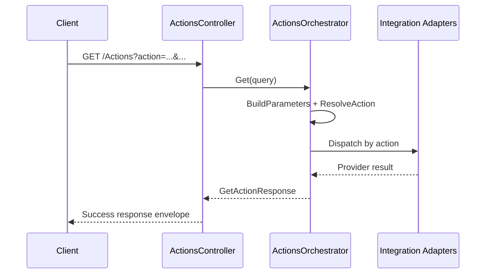
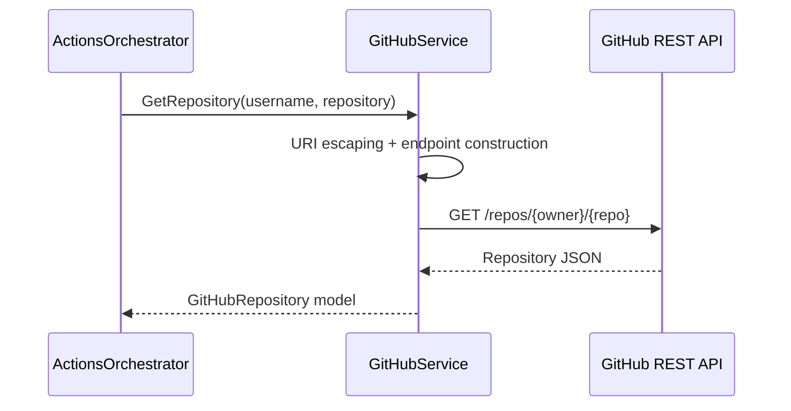
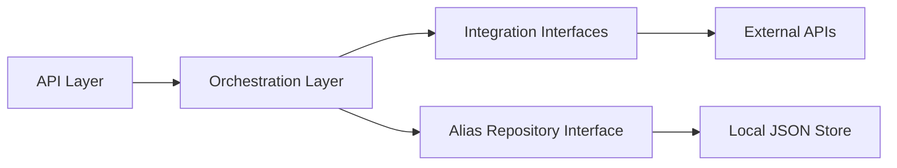

# GPT Actions Orchestrator Architecture

This document covers the current architecture of GPT Actions Orchestrator, including runtime boundaries, integration adapters, dependency rules, and operational constraints for the ASP.NET Core service in this repository.

## 📑 Table of Contents

- [Purpose](#-purpose)
- [System Context](#-system-context)
- [Architectural Style](#-architectural-style)
- [Runtime Flow](#-runtime-flow)
- [Components](#-components)
- [Architectural Areas](#-architectural-areas)
- [Data Architecture](#-data-architecture)
- [Interfaces and Integrations](#-interfaces-and-integrations)
- [Key Flows](#-key-flows)
- [Inbound Get Action Flow](#inbound-get-action-flow)
- [GitHub Repository Retrieval Flow](#github-repository-retrieval-flow)
- [Cross-Cutting Concerns](#-cross-cutting-concerns)
- [Security and Privacy](#security-and-privacy)
- [Error Handling](#error-handling)
- [Observability](#observability)
- [Configuration](#configuration)
- [Concurrency and Resource Use](#concurrency-and-resource-use)
- [Dependency Direction and Rules](#-dependency-direction-and-rules)
- [External Dependencies](#-external-dependencies)
- [Deployment and Operations](#-deployment-and-operations)
- [Compatibility Contracts](#-compatibility-contracts)
- [Testing and Verification](#-testing-and-verification)
- [Design Constraints](#-design-constraints)
- [Extension Points](#-extension-points)
- [Action Alias Catalogue](#action-alias-catalogue)
- [Source Map](#-source-map)
- [Related Documentation](#-related-documentation)

## 🎯 Purpose

The system provides one HTTP endpoint that accepts an action identifier plus query parameters, resolves aliases where applicable, dispatches to a dedicated integration service, and returns a normalised success response. The architectural scope covers API hosting, orchestration, integrations with GitHub, Personal Log Manager, and Steam Storefront, plus configuration and logging boundaries. The intended audience is contributors who need to evaluate change impact across transport, orchestration, and adapter layers.

## 🌐 System Context

The repository hosts a server-side orchestrator process. A calling client invokes the inbound HTTP endpoint, and the system performs outbound requests to external APIs. The service also reads local alias data from a JSON data file. Trust boundaries exist between the external caller and the API endpoint, and between this service and each remote provider.



The principal external boundaries are:
- **Caller or GPT Action Client:** Sends inbound GET requests to the orchestrator endpoint with API key authorisation.
- **GitHub REST API:** Outbound repository, file, release, and user-repository retrieval boundary.
- **Personal Log Manager API:** Outbound boundary for personal-log retrieval with bearer token and HMAC signing metadata.
- **Steam Storefront API:** Outbound boundary for Steam app metadata retrieval.
- **Alias JSON Store:** Local file-based lookup for action aliases before dispatch.

## 🏗️ Architectural Style

The implementation combines a transport-adapter plus orchestration style inside a modular monolith. ASP.NET Core hosts one controller boundary, while an orchestrator service performs action routing and delegates to integration adapters. Dependency injection composes all runtime services as singletons.



The principal architecture boundaries are:
- **Transport Boundary:** ASP.NET Core controller receives and authorises inbound requests.
- **Application Orchestration Boundary:** Action resolution, parameter shaping, and dispatch are centralised in one service.
- **Integration Adapter Boundary:** External systems are accessed through per-provider services behind interfaces.
- **Configuration Boundary:** Typed settings objects are bound from configuration and injected.

## 🔄 Runtime Flow



The principal runtime sequence is:
1. Host startup registers configuration, middleware, controllers, and singleton services.
2. The controller authorises the request and forwards raw query parameters to the orchestrator.
3. The orchestrator resolves the action, transforms nested query keys such as data.mood into dictionaries, dispatches to the selected adapter, and returns the normalised response.

## 🧩 Components

| Component | Responsibility | Principal Dependencies | Lifetime or Ownership |
|-----------|----------------|------------------------|-----------------------|
| `Program` | Host bootstrap and web host configuration | ASP.NET Core host builder | Process-owned static entry point |
| `Startup` | Middleware and endpoint pipeline composition | NuciAPI middleware, MVC controllers | Process-owned configuration root |
| `ActionsController` | Inbound API route and request processing wrapper | `IActionsOrchestrator`, `SecuritySettings`, `NuciApiController` | Singleton controller activation by framework |
| `ActionsOrchestrator` | Action parsing, alias resolution, request parameter shaping, adapter dispatch | Integration service interfaces, alias repository | Singleton service |
| `GitHubService` | GitHub REST retrieval operations | `HttpClient`, `GitHubSettings`, `ILogger` | Singleton service with internal `HttpClient` |
| `PersonalLogManagerService` | Personal-log request construction and signed remote call | `NuciApiClient`, `PersonalLogManagerSettings`, `SecuritySettings`, `ILogger` | Singleton service with internal API client |
| `SteamStoreService` | Steam app metadata retrieval | `HttpClient`, `ILogger` | Singleton service with internal `HttpClient` |
| `JsonRepository<GptActionAliasDataObject>` | File-backed alias lookup | `DataStoreSettings.GptActionAliasesStorePath` | Singleton repository |

## 🗂️ Architectural Areas

### Hosting and API Boundary

Paths:
- `GptActionsOrchestrator/Program.cs`
- `GptActionsOrchestrator/Startup.cs`
- `GptActionsOrchestrator/Api/Controllers/ActionsController.cs`

Responsibilities:
- Define process startup and HTTP middleware order.
- Expose the `/Actions` endpoint.
- Apply API key authorisation via Nuci API controller pipeline.

Boundary rules:
- API transport logic delegates domain routing to `IActionsOrchestrator`.
- Controllers do not directly invoke remote integration APIs.

### Orchestration and Action Model

Paths:
- `GptActionsOrchestrator/Service/ActionsOrchestrator.cs`
- `GptActionsOrchestrator/Service/IActionsOrchestrator.cs`
- `GptActionsOrchestrator/Service/Models/GptAction.cs`

Responsibilities:
- Resolve action names and IDs.
- Resolve aliases from the local datastore.
- Dispatch requests to one integration service per action.

Boundary rules:
- Action dispatch remains centralised in the orchestrator.
- New action handling requires an explicit orchestrator branch plus model registration.

### Integration Adapters

Paths:
- `GptActionsOrchestrator/Integrations/GitHub/Service/`
- `GptActionsOrchestrator/Integrations/PersonalLogManager/Service/`
- `GptActionsOrchestrator/Integrations/SteamStorefront/Service/`

Responsibilities:
- Convert orchestrator inputs into external API contracts.
- Execute outbound HTTP calls.
- Emit operation-scoped logs with status and context.

Boundary rules:
- Adapters are accessed through interfaces.
- External protocol specifics remain confined to adapter area classes.

### Configuration and Data Access

Paths:
- `GptActionsOrchestrator/Configuration/`
- `GptActionsOrchestrator/ServiceCollectionExtensions.cs`
- `GptActionsOrchestrator/Data/`
- `GptActionsOrchestrator/DataAccess/DataObjects/`

Responsibilities:
- Bind typed settings from application configuration.
- Register concrete service and repository implementations.
- Persist and resolve action aliases via a JSON file repository.

Boundary rules:
- Configuration values are injected, not hardcoded at call sites.
- Alias metadata is externalised to the data file path configured in settings.

## 💾 Data Architecture

The system owns minimal local state and primarily acts as a transient transformation and proxy layer. Inbound query parameters are converted into a dictionary that may contain nested dictionaries for dotted keys. The only persisted application-owned data is the action-alias JSON file. Most data models are transport models for external API responses.



| Data or Store | Owner | Representation and Storage | Lifecycle or Consistency |
|---------------|-------|----------------------------|--------------------------|
| `GetActionRequest` query data | API controller and orchestrator | Query string converted to dictionaries in memory | Per-request ephemeral state |
| `GptAction` registry | Orchestration layer | Static in-memory action catalogue | Process lifetime; code-defined consistency |
| `GptActionAliasDataObject` entries | Alias repository | JSON records in `Data/gpt-action-aliases.json` | Persistent file state; loaded on access |
| `GetActionResponse` payload | API boundary | Response object with action name and object data | Per-request response envelope |
| External provider models | Integration adapters | Deserialised response models in memory | Per-request ephemeral state |

## 🔌 Interfaces and Integrations

| Interface or Integration | Direction | Contract | Owner | Failure Semantics |
|--------------------------|-----------|----------|-------|-------------------|
| `GET /Actions` | Inbound | HTTP GET query contract with `action` plus action-specific parameters | `ActionsController` | Middleware-level exception handling translates failures to API errors |
| `IGitHubService` integration | Outbound | GitHub REST endpoints under `https://api.github.com` with API version header | `GitHubService` | Exceptions are logged and rethrown |
| `IPersonalLogManagerService` integration | Outbound | NuciAPI client request to Personal Log Manager `PersonalLog` endpoint | `PersonalLogManagerService` | Unsuccessful API response triggers exception |
| `ISteamStoreService` integration | Outbound | Steam Storefront appdetails endpoint with app ID query | `SteamStoreService` | Exceptions are logged; method returns null entity on failure |
| `IFileRepository<GptActionAliasDataObject>` | Outbound | JSON file repository lookup by action ID | `ActionsOrchestrator` composition | Missing alias leaves action unchanged |

## 🔀 Key Flows

### Inbound Get Action Flow



The flow centralises routing in `ActionsOrchestrator`, so controller behaviour remains stable while action-specific integration logic evolves behind interfaces.

### GitHub Repository Retrieval Flow



The adapter normalises endpoint construction and headers. Exception ownership remains in the adapter, which logs failure and rethrows to upstream middleware.

## 🧵 Cross-Cutting Concerns

### Security and Privacy

Inbound access is guarded with API key authorisation in the controller. Outbound Personal Log Manager requests use bearer token plus HMAC signing metadata. Outbound GitHub requests can include bearer authentication. Secret values are configuration-driven and should be supplied via secure configuration sources rather than committed values. This service transmits and logs operational metadata; sensitive payload minimisation depends on integration input discipline.

### Error Handling

Global API exception handling middleware is registered early in the pipeline. GitHub and Personal Log Manager adapters log and rethrow exceptions, which propagate to middleware translation. Steam adapter logs exceptions but does not rethrow, returning null when retrieval fails. Unknown or missing action values result in `NotImplementedException` in orchestration.

### Observability

Request logging middleware is enabled. Integration adapters emit started/success/failure operation logs through `ILogger` with contextual keys such as username, repository, date range, and app ID. File logging destination and enablement are controlled by logger settings.

### Configuration

| Configuration Area | Source | Responsibility | Override or Secret Policy |
|--------------------|--------|----------------|---------------------------|
| `SecuritySettings` | `appsettings.json` and default ASP.NET Core configuration providers | Inbound API key and client identifier for outbound authorisation metadata | API keys must be supplied through secure secret injection in non-local environments |
| `DataStoreSettings` | `appsettings.json` | Alias datastore path selection | Path can be overridden by configuration provider precedence |
| `GitHubSettings` | `appsettings.json` | Default username and GitHub token for authenticated requests | Token must be treated as a secret |
| `PersonalLogManagerSettings` | `appsettings.json` | Base URL, bearer token, and HMAC key for Personal Log Manager integration | Token and HMAC key must be treated as secrets |
| `NuciLoggerSettings` | `appsettings.json` | Log file output location and enablement | File output policy is environment-specific |

### Concurrency and Resource Use

All principal services are registered as singletons. Service methods currently use synchronous waits on asynchronous HTTP calls, so each request thread remains occupied during outbound I/O. No explicit queueing or parallel orchestration is implemented in the orchestrator path. Capacity therefore depends primarily on ASP.NET Core thread-pool availability and external API latency.

## 🧭 Dependency Direction and Rules

Dependencies flow inward from transport to orchestration to integration adapters and data repository abstractions. Stable boundaries are protected by interfaces (`IActionsOrchestrator`, `IGitHubService`, `IPersonalLogManagerService`, `ISteamStoreService`).



The principal dependency rules are:
- API controller dependencies should terminate at orchestration interfaces rather than concrete adapter classes.
- Integration adapters should not depend on controller types or HTTP endpoint abstractions.
- Action model identifiers in `GptAction` are canonical contracts and should remain the authority for dispatch decisions.
- Alias indirection may map to canonical action IDs, but canonical IDs remain the integration-dispatch source of truth.

## 📦 External Dependencies

| Dependency | Responsibility | Integration Boundary | Architectural Consequence |
|------------|----------------|----------------------|---------------------------|
| `ASP.NET Core` | Web host, middleware pipeline, routing, controller activation | Hosting and API boundary | Process lifecycle and HTTP transport behaviour follow framework conventions |
| `NuciAPI` libraries | API controller base classes, middleware, and client primitives | Inbound and Personal Log Manager integration boundary | Security and exception middleware behaviour depends on NuciAPI components |
| `NuciDAL` | JSON file repository abstraction and implementation | Alias datastore boundary | Alias resolution depends on file repository semantics |
| `NuciWeb.HTTP` | HTTP client creation helper | GitHub and Steam adapters | Outbound transport setup is coupled to helper library behaviour |
| `NuciLog` | Structured operation logging | Cross-cutting observability boundary | Diagnostic signal format and destinations depend on logger configuration |

## 🚀 Deployment and Operations

The service is a single ASP.NET Core web process targeting `net10.0`. It has no database dependency; persistent local state is limited to a JSON alias file and optional log file output.

| Concern | Current Design | Architectural Consequence |
|---------|----------------|---------------------------|
| Process topology | Single process web API host | Simple deployment unit with no distributed orchestration inside the repository |
| Persistent state | File-based alias datastore and optional log file | Shared filesystem path correctness affects alias resolution and logging |
| Scaling | Stateless request processing apart from local files and singleton service state | Horizontal scaling is feasible when configuration and local file assumptions are handled per instance |
| External availability | Runtime depends on GitHub, Personal Log Manager, and Steam APIs for most actions | Upstream latency or outage directly impacts action responses |
| Startup and shutdown | ASP.NET Core default host lifecycle with Startup composition | Middleware order and singleton initialisation are fixed at process start |

## 🛡️ Compatibility Contracts

| Contract | Owner | Invariant | Verification | Change Policy |
|----------|-------|-----------|--------------|---------------|
| `action` query identifier semantics | Orchestration layer | Canonical action IDs and names must continue to map to expected dispatch branches | Unit tests in `ActionsOrchestratorTests` and `GptActionTests` | Preserve existing IDs; add aliases for new synonyms rather than repurposing existing IDs |
| Nested query key conversion | Orchestration layer | Dotted keys (for example `data.mood`) must be transformed into child dictionary entries | Unit test `GivenGetPersonalLogsWithNestedDataParameters_WhenGetIsCalled_ThenDataDictionaryIsPassedToService` | Maintain conversion rule or introduce additive migration support |
| Response envelope shape | API response layer | Success responses include action plus provider-specific data object | Integration and consumer contract validation | Breaking envelope changes require explicit consumer migration |

## ✅ Testing and Verification

The unit-test project verifies action resolution, dispatch selection, alias-independent routing by name or ID, and selected parameter-shaping behaviour. Adapter internals and middleware interactions are not fully covered by automated tests in this repository.

Execute the principal automated verification with:

```bash
dotnet test GptActionsOrchestrator.slnx
```

## ⚠️ Design Constraints

- **Centralised Dispatch Branching:** `ActionsOrchestrator` uses explicit conditional branching per action, which simplifies traceability but increases modification pressure as actions grow.
- **Synchronous Waits on Async Calls:** Integration services block on asynchronous HTTP operations via `.Result`, which can constrain throughput under high latency.
- **File-Based Alias Coupling:** Alias availability depends on the configured JSON file path and repository implementation semantics.
- **Provider-Specific Failure Semantics:** Steam adapter returns null on failure while other adapters rethrow, yielding non-uniform error propagation behaviour.

## 🔧 Extension Points

### Action Alias Catalogue

1. Implement or revise the alias entry in `Data/gpt-action-aliases.json`.
2. Register or integrate new dispatch handling in `ActionsOrchestrator` and `GptAction` when a genuinely new canonical action is introduced.
3. Add the verification required to preserve neighbouring contracts in unit tests.

Action extension must preserve canonical action ID stability and query-parameter semantics expected by existing callers.

## 🗺️ Source Map

| Area | Path |
|------|------|
| Host bootstrap and composition | `GptActionsOrchestrator/Program.cs` |
| Pipeline and middleware | `GptActionsOrchestrator/Startup.cs` |
| DI and settings registration | `GptActionsOrchestrator/ServiceCollectionExtensions.cs` |
| API boundary | `GptActionsOrchestrator/Api/` |
| Orchestration core | `GptActionsOrchestrator/Service/` |
| External integrations | `GptActionsOrchestrator/Integrations/` |
| Configuration models | `GptActionsOrchestrator/Configuration/` |
| Alias datastore and data objects | `GptActionsOrchestrator/Data/`, `GptActionsOrchestrator/DataAccess/` |
| Tests | `GptActionsOrchestrator.UnitTests/` |

## 📚 Related Documentation

- [README.md](README.md): Project overview, configuration examples, supported actions, and endpoint usage.
- [SECURITY.md](SECURITY.md): Vulnerability reporting process, supported security-maintenance scope, and disclosure policy.
