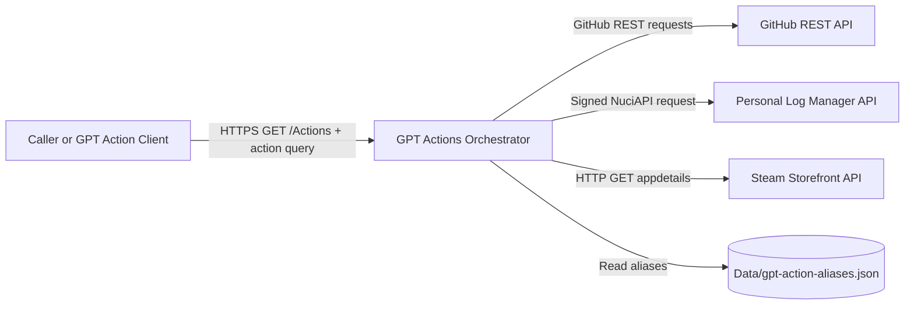
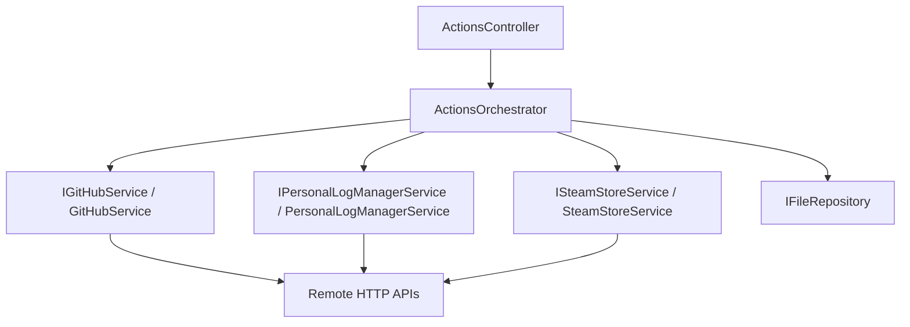
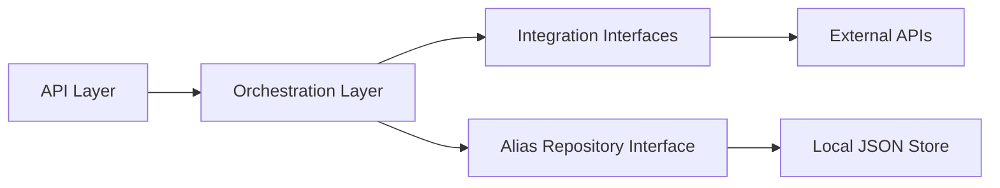

# Architecture Overview

## System Context

GPT Actions Orchestrator is a .NET 10.0 ASP.NET Core web service that exposes a single HTTP endpoint (`GET /Actions`) and dispatches requests to one of three upstream integrations: GitHub REST API, Personal Log Manager API, and Steam Storefront API.

### Trust Boundaries

| Boundary | Direction | Mechanism |
|----------|-----------|-----------|
| External caller → API endpoint | Inbound | API key authorisation via `NuciApiAuthorisation.ApiKey` |
| Service → GitHub API | Outbound | Optional Bearer token from `GitHubSettings.ApiKey` |
| Service → Personal Log Manager API | Outbound | Bearer token + HMAC signing from `PersonalLogManagerSettings` |
| Service → Steam Storefront API | Outbound | No authentication (public endpoint) |
| Service → Local alias file | Local | File system read via `JsonRepository` |

## Architectural Style

The implementation follows a **transport-adapter plus orchestration** style within a modular monolith:

### Dependency Direction

Dependencies flow inward:

**Rules:**
- API controller dependencies terminate at orchestration interfaces, not concrete adapter classes
- Integration adapters do not depend on controller types or HTTP endpoint abstractions
- `GptAction` canonical IDs are the authority for dispatch decisions
- Alias indirection maps to canonical action IDs; canonical IDs remain the dispatch source of truth

## Component Inventory

| Component | Responsibility | Principal Dependencies | Lifetime |
|-----------|----------------|------------------------|----------|
| `Program` | Host bootstrap and web host configuration | ASP.NET Core host builder | Process-owned static entry point |
| `Startup` | Middleware and endpoint pipeline composition | NuciAPI middleware, MVC controllers | Process-owned configuration root |
| `ActionsController` | Inbound API route and request processing wrapper | `IActionsOrchestrator`, `SecuritySettings`, `NuciApiController` | Singleton (framework-activated) |
| `ActionsOrchestrator` | Action parsing, alias resolution, parameter shaping, adapter dispatch | Integration service interfaces, alias repository | Singleton |
| `GitHubService` | GitHub REST retrieval operations | `HttpClient`, `GitHubSettings`, `ILogger` | Singleton |
| `PersonalLogManagerService` | Personal-log request construction and signed remote call | `NuciApiClient`, `PersonalLogManagerSettings`, `SecuritySettings`, `ILogger` | Singleton |
| `SteamStoreService` | Steam app metadata retrieval | `HttpClient`, `ILogger` | Singleton |
| `JsonRepository<GptActionAliasDataObject>` | File-backed alias lookup | `DataStoreSettings.GptActionAliasesStorePath` | Singleton |

## Runtime Topology

The service is a single ASP.NET Core web process targeting `net10.0`:

- **Process topology:** Single process web API host
- **Persistent state:** File-based alias datastore (`Data/gpt-action-aliases.json`) and optional log file (`logfile.log`)
- **Scaling:** Stateless request processing apart from local files and singleton service state
- **External availability:** Runtime depends on GitHub, Personal Log Manager, and Steam APIs
- **Startup/shutdown:** ASP.NET Core default host lifecycle with `Startup` composition

## Key Invariants

1. **Singleton service model:** All principal services are registered as singletons
2. **Centralised dispatch:** All action routing occurs in `ActionsOrchestrator`
3. **Canonical action IDs:** `GptAction` static instances are the single source of truth for dispatch
4. **Alias indirection:** Aliases resolve to canonical IDs before dispatch
5. **Configuration-driven:** All credentials and paths come from configuration, not hardcoded values
6. **No telemetry:** No crash reports, update checks, or data sent to maintainers

## Design Constraints

- **Centralised dispatch branching:** `ActionsOrchestrator` uses explicit conditional branching per action
- **Synchronous waits on async calls:** Integration services block on async HTTP via `.Result`
- **File-based alias coupling:** Alias availability depends on configured JSON file path
- **Provider-specific failure semantics:** Steam adapter returns null on failure; others rethrow

## Related Documentation

- [Runtime Execution Flows](runtime-flows.md) — detailed sequence diagrams
- [Component Reference](component-reference.md) — per-component details
- [Integration Adapters](integration-adapters.md) — adapter implementations
- [Orchestration Engine](orchestration-engine.md) — dispatch and parameter logic
- [API Boundary](api-boundary.md) — controller and middleware
- [Configuration System](configuration-system.md) — settings binding
- [Data Architecture](data-architecture.md) — data models and transformations
- [Logging and Observability](logging-observability.md) — diagnostic signal flow
- [Error Handling](error-handling.md) — exception propagation
- [Testing Strategy](testing-strategy.md) — test coverage and architecture
- [Extension Guide](extension-guide.md) — adding new capabilities
- [Source Map](source-map.md) — file-to-responsibility mapping