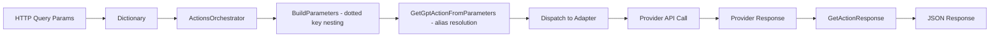

# Data Architecture

Detailed documentation of data structures, transformations, and persistence.

## Overview

The data architecture consists of:
- **In-memory transformations** — Parameter dictionaries, nested structures
- **Alias datastore** — JSON file repository for action aliases
- **External response models** — Provider-specific data objects
- **Canonical models** — `GptAction` registry, `GetActionResponse`

## Data Flow



## In-Memory Data Structures

### Query Parameter Dictionary

**Type:** `Dictionary<string, string>`

**Source:** `Request.Query.ToDictionary()` in `ActionsController`

**Example:**
```csharp
// Query: ?action=GetGitHubRepository&username=hmlendea&repository=gpt-actions-orchestrator
{
    "action": "GetGitHubRepository",
    "username": "hmlendea",
    "repository": "gpt-actions-orchestrator"
}
```

### Parameters Dictionary (after BuildParameters)

**Type:** `Dictionary<string, object>`

**Transformation:** `ActionsOrchestrator.BuildParameters()`

**Logic:**
- Keys without dots → string values
- Keys with dots → nested `Dictionary<string, string>`

**Example:**
```csharp
// Input: ?action=GetPersonalLogs&data.mood=happy&data.energy=high
{
    "action": "GetPersonalLogs",
    "data": new Dictionary<string, string>
    {
        { "mood", "happy" },
        { "energy", "high" }
    }
}
```

**Limitation:** Only single-level nesting supported. `data.sub.key` would create `data` → `sub.key` (not nested).

### Action Parameters Dictionary

**Type:** `Dictionary<string, string>`

**Source:** `ActionsOrchestrator.GetGptActionFromParameters()`

**Logic:** Extracts `action` key, removes it from parameters

**Example:**
```csharp
// After extraction
{
    "username": "hmlendea",
    "repository": "gpt-actions-orchestrator"
}
```

## Alias Datastore

### Data Object

**File:** `GptActionsOrchestrator/DataAccess/DataObjects/GptActionAliasDataObject.cs`

```csharp
public sealed class GptActionAliasDataObject
{
    public string Alias { get; set; }     // e.g., "github.file.get"
    public string Target { get; set; }    // e.g., "github.repository.file.get"
}
```

### JSON File

**File:** `GptActionsOrchestrator/Data/gpt-action-aliases.json`

**Format:** Array of `{ alias, target }` objects

```json
[
  { "alias": "github.file.get", "target": "github.repository.file.get" },
  { "alias": "github.readme.get", "target": "github.repository.readme.get" },
  { "alias": "github.releases.get", "target": "github.repository.releases.get" },
  { "alias": "github.repos.get", "target": "github.user.repositories.get" },
  { "alias": "personal.logs.get", "target": "personal.logs.get" },
  { "alias": "steam.app.get", "target": "steam.app.get" }
]
```

**Total:** 27 alias mappings

### Repository

**Type:** `JsonRepository<GptActionAliasDataObject>` (from NuciDAL)

**Configuration:** `DataStoreSettings.GptActionAliasesStorePath`

**Operations:**
- `GetAll()` — Returns all aliases as `IEnumerable<GptActionAliasDataObject>`
- `GetByAlias(string alias)` — Returns single matching alias or null

**Storage:** JSON file with UTF-8 encoding

**Thread Safety:** NuciDAL `JsonRepository` is thread-safe for read operations

## Canonical Models

### GptAction

**File:** `GptActionsOrchestrator/Service/Models/GptAction.cs`

**Purpose:** Canonical action registry with ID/name mapping

```csharp
public sealed class GptAction
{
    public string Id { get; }      // e.g., "github.repository.file.get"
    public string Name { get; }    // e.g., "GetGitHubRepositoryFile"
    public string Alias { get; }   // e.g., "github.file.get" (if applicable)
}
```

**Registry:** Static `Values` dictionary (8 entries: Unknown + 7 real actions)

| Id | Name | Alias |
|----|------|-------|
| `unknown` | `Unknown` | — |
| `github.user.repositories.get` | `GetGitHubUserRepositories` | `github.repos.get` |
| `github.repository.get` | `GetGitHubRepository` | — |
| `github.repository.file.get` | `GetGitHubRepositoryFile` | `github.file.get` |
| `github.repository.readme.get` | `GetGitHubRepositoryReadme` | `github.readme.get` |
| `github.repository.releases.get` | `GetGitHubRepositoryReleases` | `github.releases.get` |
| `personal.logs.get` | `GetPersonalLogs` | `personal.logs.get` |
| `steam.app.get` | `GetSteamAppData` | `steam.app.get` |

**FromString() Method:**
- Matches against both `Id` and `Name`
- Returns `Unknown` if no match
- Case-sensitive

### GetActionResponse

**File:** `GptActionsOrchestrator/Api/Responses/GetActionResponse.cs`

```csharp
public sealed class GetActionResponse : NuciApiSuccessResponse
{
    public string GptActionName { get; set; }  // From GptAction.ToString()
    public object Data { get; set; }           // Provider-specific
}
```

**Inheritance:** `NuciApiSuccessResponse` adds `success: true`

## External Response Models

### GitHub Response Models

**Source:** `GptActionsOrchestrator/Integrations/GitHub/Service/GitHubService.cs`

**No dedicated model classes** — Uses `JsonDocument` for dynamic parsing

**Extracted Fields:**
- `name` (string)
- `description` (string)
- `language` (string)
- `stargazers_count` → `stargazersCount` (int)
- `topics` (string[])
- `archived` → `isArchived` (bool)
- `private` → `isPrivate` (bool)
- `fork` → `isFork` (bool)
- `created_at` → `createdAt` (DateTime)
- `pushed_at` → `pushedAt` (DateTime)

**File Content:**
- `content` (string, base64-encoded)
- `encoding` (string, "base64")
- `size` (int)

**Releases:**
- `name` (string)
- `tag_name` → `tagName` (string)
- `published_at` → `publishedAt` (DateTime)
- `html_url` → `htmlUrl` (string)
- `body` (string)

### Personal Log Manager Response Models

**Source:** `GptActionsOrchestrator/Integrations/PersonalLogManager/Service/PersonalLogManagerService.cs`

**Uses:** `NuciApiClient` response parsing

**Response Structure:**
```csharp
{
    "logs": string[],     // Array of log entries
    "count": int         // Number of entries
}
```

### Steam Storefront Response Models

**Source:** `GptActionsOrchestrator/Integrations/SteamStorefront/Service/SteamStoreService.cs`

**Uses:** `JsonDocument` for dynamic parsing

**Response Structure:**
```csharp
{
    "id": string,         // App ID
    "name": string        // App name
}
```

**Note:** Returns `null` on failure (unique among adapters)

## Data Transformations

### Parameter Building

**Method:** `ActionsOrchestrator.BuildParameters()`

**Input:** `Dictionary<string, string>` (raw query params)

**Output:** `Dictionary<string, object>` (with nested dictionaries)

**Algorithm:**
```csharp
foreach (var pair in rawParameters)
{
    if (pair.Key.Contains('.'))
    {
        var parts = pair.Key.Split('.', 2);
        var parentKey = parts[0];
        var childKey = parts[1];

        if (!parameters.ContainsKey(parentKey))
        {
            parameters[parentKey] = new Dictionary<string, string>();
        }

        ((Dictionary<string, string>)parameters[parentKey])[childKey] = pair.Value;
    }
    else
    {
        parameters[pair.Key] = pair.Value;
    }
}
```

### Alias Resolution

**Method:** `ActionsOrchestrator.GetGptActionFromParameters()`

**Input:** `Dictionary<string, object>` (built parameters)

**Output:** `GptAction` (resolved action)

**Algorithm:**
1. Extract `action` parameter value
2. Look up in alias datastore: `aliasRepository.GetByAlias(action)`
3. If alias found, use `target` as action name
4. If no alias, use original value
5. Call `GptAction.FromString(resolvedAction)`
6. Return `GptAction.Unknown` if not found

### Response Construction

**Method:** `ActionsOrchestrator.GetActionResponse()`

**Input:** `GptAction`, `Dictionary<string, string>` (action parameters), `object` (provider data)

**Output:** `GetActionResponse`

**Algorithm:**
```csharp
return new GetActionResponse
{
    GptActionName = gptAction.ToString(),
    Data = providerData
};
```

## Data Persistence

### Alias File

**Location:** `Data/gpt-action-aliases.json` (relative to working directory)

**Format:** JSON array

**Update Mechanism:** Manual file edit only (no runtime updates)

**Backup:** Not automated — relies on source control

### Log File

**Location:** `logfile.log` (default, configurable via `nuciLoggerSettings.logFilePath`)

**Format:** Structured log entries (NuciLog format)

**Rotation:** Not configured (single file grows indefinitely)

## Data Integrity

### Alias Consistency

- Aliases must map to valid `GptAction.Id` values
- No runtime validation — invalid aliases resolve to `GptAction.Unknown`
- Changes require application restart (singleton repository)

### Parameter Validation

- No schema validation at API boundary
- Missing parameters cause `KeyNotFoundException` in adapters
- Null/empty values passed through to providers

### Response Data

- Provider responses parsed dynamically (no schema validation)
- Missing fields result in `null` or default values
- Type mismatches cause `JsonException`

## Data Access Patterns

### Read Patterns

| Component | Pattern | Frequency |
|-----------|---------|-----------|
| Alias Repository | `GetAll()` at startup, `GetByAlias()` per request | High |
| GitHub Service | HTTP GET per request | Per request |
| PLM Service | HTTP GET per request | Per request |
| Steam Service | HTTP GET per request | Per request |

### Write Patterns

| Component | Pattern | Frequency |
|-----------|---------|-----------|
| Alias File | Manual edit only | Rare |
| Log File | Append per operation | High |

## Data Size Considerations

### Query Parameters
- ASP.NET Core default query string limit: ~2KB
- No explicit limit on number of parameters
- Nested `data.*` parameters can grow large

### Alias File
- 27 entries, ~1KB
- Loaded into memory at startup
- No caching layer (direct file read)

### Log File
- Grows indefinitely
- No rotation or retention policy
- Should be managed by infrastructure (log shipper, rotation)

## Related Documentation

- [Architecture Overview](architecture-overview.md) - High-level context
- [Orchestration Engine](orchestration-engine.md) - Parameter building, alias resolution
- [Configuration System](configuration-system.md) - DataStoreSettings
- [Integration Adapters](integration-adapters.md) - Provider response models
- [Source Map](source-map.md) - File locations