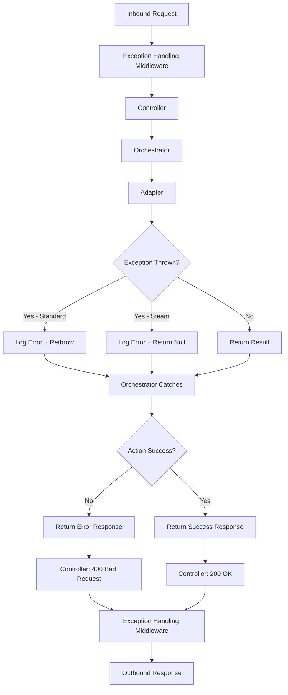

# Error Handling

Comprehensive documentation of the error handling strategy, exception types, failure semantics, and error response contracts.

## Overview

The system uses a layered error handling approach:
1. **Middleware** — Global exception handling and response formatting
2. **Adapters** — Operation-level logging and exception propagation
3. **Orchestrator** — Action-level error aggregation and response construction
4. **Controller** — HTTP-level error responses

## Global Exception Handling

### Middleware Stack

**File:** `GptActionsOrchestrator/Startup.cs`

```csharp
public void Configure(IApplicationBuilder app, IWebHostEnvironment env)
{
    app.UseNuciApiExceptionHandling();  // First in pipeline
    app.UseNuciApiRequestLogging();
    app.UseNuciApiSecurity();
    app.UseNuciApiScannerProtection();
    app.UseRouting();
    app.UseEndpoints(endpoints => endpoints.MapControllers());
}
```

**Order:** Exception handling middleware is registered first, ensuring all downstream exceptions are caught.

### Exception Handling Middleware

**Package:** `NuciAPI.Middleware.ExceptionHandling`

**Behavior:**
- Catches all unhandled exceptions
- Logs exception details (with sensitive data masking)
- Returns standardized JSON error response
- Sets appropriate HTTP status codes

**Response Format:**
```json
{
  "error": {
    "message": "An error occurred while processing your request.",
    "code": "INTERNAL_ERROR"
  }
}
```

## Adapter-Level Error Handling

### Standard Pattern (GitHub, PLM)

**File:** `GptActionsOrchestrator/Integrations/GitHub/Service/GitHubService.cs`

```csharp
public async Task<GitHubRepository> GetRepository(string username, string repository)
{
    IEnumerable<LogInfo> logInfos = [
        new(MyLogInfoKey.Username, username),
        new(MyLogInfoKey.Repository, repository)
    ];

    logger.Info(
        MyOperation.GitHubRepositoryRetrieval,
        OperationStatus.Started,
        logInfos);

    try
    {
        var result = await DoWork();

        logger.Debug(
            MyOperation.GitHubRepositoryRetrieval,
            OperationStatus.Success,
            logInfos,
            new LogInfo(MyLogInfoKey.Count, result.Count));

        return result;
    }
    catch (Exception exception)
    {
        logger.Error(
            MyOperation.GitHubRepositoryRetrieval,
            OperationStatus.Failure,
            exception,
            logInfos);

        throw;  // Propagate to orchestrator
    }
}
```

**Failure Semantics:**
- Exception is logged with full context
- Exception is rethrown to caller
- Caller (orchestrator) decides how to handle

### Steam Pattern (Graceful Degradation)

**File:** `GptActionsOrchestrator/Integrations/SteamStorefront/Service/SteamStoreService.cs`

```csharp
public SteamAppEntity GetAppData(string appId)
{
    IEnumerable<LogInfo> logInfos = [
        new(MyLogInfoKey.AppId, appId)
    ];

    logger.Info(
        MyOperation.SteamStoreAppDataRetrieval,
        OperationStatus.Started,
        logInfos);

    SteamAppEntity steamAppEntity = null;

    try
    {
        steamAppEntity = DoWork();
    }
    catch (Exception exception)
    {
        // Log failure but DON'T rethrow
        logger.Error(
            MyOperation.SteamStoreAppDataRetrieval,
            OperationStatus.Failure,
            exception,
            logInfos);
    }

    // Always log success (even if entity is null)
    logger.Debug(
        MyOperation.SteamStoreAppDataRetrieval,
        OperationStatus.Success,
        logInfos);

    return steamAppEntity;  // May be null
}
```

**Failure Semantics:**
- Exception is logged but swallowed
- Returns `null` instead of throwing
- Allows orchestrator to handle missing data gracefully

## Orchestrator-Level Error Handling

**File:** `GptActionsOrchestrator/Service/ActionsOrchestrator.cs`

### Error Aggregation Pattern

```csharp
public async Task<GptActionResponse> ExecuteAction(GptAction action)
{
    try
    {
        return await DispatchAction(action);
    }
    catch (Exception exception)
    {
        // Log at orchestrator level
        logger.Error(
            MyOperation.ExecuteAction,
            OperationStatus.Failure,
            exception,
            new LogInfo(MyLogInfoKey.GptAction, action.Name));

        // Return error response (don't rethrow)
        return new GptActionResponse
        {
            Success = false,
            Error = exception.Message
        };
    }
}
```

### Per-Action Error Handling

Each action type has its own try/catch:

```csharp
private async Task<GptActionResponse> ExecuteGitHubAction(GptAction action)
{
    try
    {
        var result = await gitHubService.GetRepository(...);
        return new GptActionResponse { Success = true, Data = result };
    }
    catch (HttpRequestException ex)
    {
        // Network/API errors
        return new GptActionResponse { Success = false, Error = "GitHub API unavailable" };
    }
    catch (Exception ex)
    {
        // Unexpected errors
        return new GptActionResponse { Success = false, Error = "Unexpected error" };
    }
}
```

## Controller-Level Error Handling

**File:** `GptActionsOrchestrator/Api/Controllers/ActionsController.cs`

```csharp
[ApiController]
[Route("api/[controller]")]
public class ActionsController : ControllerBase
{
    [HttpPost]
    public async Task<IActionResult> ExecuteAction([FromBody] GetActionRequest request)
    {
        var response = await orchestrator.ExecuteAction(request.Action);

        if (response.Success)
            return Ok(response);
        else
            return BadRequest(response);
    }
}
```

**Behavior:**
- Orchestrator returns response object (never throws)
- Controller maps success/failure to HTTP status codes
- No exception handling in controller (delegated to middleware)

## Exception Types

### Custom Exceptions

**None currently defined.** The system relies on:
- Standard .NET exceptions (`HttpRequestException`, `JsonException`, etc.)
- NuciAPI middleware for formatting

### External Exceptions

| Source | Exception Type | Handling |
|--------|---------------|----------|
| GitHub API | `HttpRequestException` | Rethrown, caught by orchestrator |
| PLM API | `HttpRequestException` | Rethrown, caught by orchestrator |
| Steam API | `HttpRequestException` | Swallowed, returns null |
| JSON parsing | `JsonException` | Rethrown, caught by orchestrator |
| Configuration | `InvalidOperationException` | Propagates to startup |

## Error Response Contracts

### Success Response

```json
{
  "success": true,
  "data": { ... }
}
```

### Failure Response

```json
{
  "success": false,
  "error": "Error message"
}
```

### HTTP Status Codes

| Scenario | Status Code |
|----------|-------------|
| Successful action | 200 OK |
| Action failure | 400 Bad Request |
| Invalid request | 400 Bad Request |
| Unauthorized | 401 Unauthorized |
| Forbidden | 403 Forbidden |
| Internal error | 500 Internal Server Error |

## Security Considerations

### Sensitive Data Masking

**File:** `GptActionsOrchestrator/Startup.cs`

```csharp
app.UseNuciApiSecurity();  // Handles masking
```

**What is masked:**
- Authorization headers
- API keys in request/response
- Connection strings
- Personal data in logs

### Exception Message Safety

**Current State:**
- Exception messages from external APIs may contain sensitive data
- No explicit sanitization before returning to client

**Recommended:**
```csharp
catch (HttpRequestException ex)
{
    // Log full exception internally
    logger.Error(..., ex, ...);

    // Return generic message to client
    return new GptActionResponse
    {
        Success = false,
        Error = "External service unavailable"
    };
}
```

## Testing Error Handling

### Unit Tests

**File:** `GptActionsOrchestrator.UnitTests/Service/ActionsOrchestratorTests.cs`

```csharp
[Test]
public async Task ExecuteAction_WhenAdapterThrows_ReturnsErrorResponse()
{
    // Arrange
    var gitHubServiceMock = new Mock<IGitHubService>();
    gitHubServiceMock.Setup(x => x.GetRepository(...))
        .ThrowsAsync(new HttpRequestException("API down"));

    var orchestrator = new ActionsOrchestrator(gitHubServiceMock.Object, ...);

    // Act
    var response = await orchestrator.ExecuteAction(action);

    // Assert
    Assert.IsFalse(response.Success);
    Assert.IsNotNull(response.Error);
}
```

### Integration Tests

**File:** `GptActionsOrchestrator.IntegrationTests/Infrastructure/ActionsWebApplicationFactory.cs`

```csharp
// Mock logger to suppress output
services.RemoveAll<ILogger>();
services.AddSingleton(Mock.Of<ILogger>());
```

## Error Handling Flow Diagram



## Related Documentation

- [Logging and Observability](logging-observability.md) - Error logging
- [Orchestration Engine](orchestration-engine.md) - Orchestrator error handling
- [Integration Adapters](integration-adapters.md) - Adapter failure semantics
- [API Boundary](api-boundary.md) - HTTP error responses
- [Security](security.md) - Sensitive data handling
- [Source Map](source-map.md) - File locations