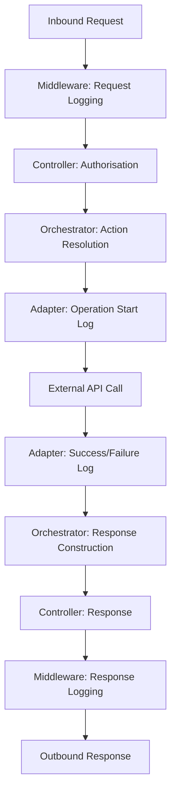

# Logging and Observability

Detailed documentation of the logging infrastructure, operation logging, log info keys, and diagnostic signal flow.

## Overview

The system uses **NuciLog** for structured operation logging with custom log info keys and operation identifiers.

## Logging Infrastructure

### Logger Registration

**File:** `GptActionsOrchestrator/ServiceCollectionExtensions.cs`

```csharp
public static IServiceCollection AddCustomServices(this IServiceCollection services) => services
    // ... other registrations ...
    .AddSingleton<ILogger, NuciLogger>();
```

**Logger Type:** `NuciLogger` (from `NuciLog` package)
**Interface:** `ILogger` (from `NuciLog.Core`)

### Logger Configuration

**Settings:** `NuciLoggerSettings` (from NuciLog library)
**Section:** `nuciLoggerSettings` in `appsettings.json`

```json
{
  "nuciLoggerSettings": {
    "logFilePath": "logfile.log",
    "isFileOutputEnabled": true
  }
}
```

**Properties:**
- `logFilePath`: Output file path (relative to working directory)
- `isFileOutputEnabled`: Enable/disable file logging

### Middleware Logging

**File:** `GptActionsOrchestrator/Startup.cs`

```csharp
app.UseNuciApiRequestLogging();  // From NuciAPI.Middleware.Logging
```

**Purpose:** Logs all HTTP requests and responses
**Scope:** Entire middleware pipeline

## Custom Log Info Keys

**File:** `GptActionsOrchestrator/Logging/MyLogInfoKey.cs`

```csharp
public sealed class MyLogInfoKey : LogInfoKey
{
    private MyLogInfoKey(string name) : base(name) { }

    public static LogInfoKey GptAction => new MyLogInfoKey(nameof(GptAction));
    public static LogInfoKey AppId => new MyLogInfoKey(nameof(AppId));
    public static LogInfoKey Count => new MyLogInfoKey(nameof(Count));
    public static LogInfoKey DateBeginning => new MyLogInfoKey(nameof(DateBeginning));
    public static LogInfoKey DateEnd => new MyLogInfoKey(nameof(DateEnd));
    public static LogInfoKey Localisation => new MyLogInfoKey(nameof(Localisation));
    public static LogInfoKey Path => new MyLogInfoKey(nameof(Path));
    public static LogInfoKey Reference => new MyLogInfoKey(nameof(Reference));
    public static LogInfoKey Repository => new MyLogInfoKey(nameof(Repository));
    public static LogInfoKey Template => new MyLogInfoKey(nameof(Template));
    public static LogInfoKey Username => new MyLogInfoKey(nameof(Username));
}
```

### Key Usage by Adapter

| Adapter | Keys Used |
|---------|-----------|
| GitHubService | `Username`, `Repository`, `Path`, `Count` |
| PersonalLogManagerService | `Template`, `DateBeginning`, `DateEnd`, `Localisation`, `Count` |
| SteamStoreService | `AppId` |

## Custom Operations

**File:** `GptActionsOrchestrator/Logging/MyOperation.cs`

```csharp
public sealed class MyOperation : Operation
{
    private MyOperation(string name) : base(name) { }

    public static Operation GetPersonalLogs => new MyOperation(nameof(GetPersonalLogs));
    public static Operation GitHubRepositoryRetrieval => new MyOperation(nameof(GitHubRepositoryRetrieval));
    public static Operation GitHubRepositoryFileContentRetrieval => new MyOperation(nameof(GitHubRepositoryFileContentRetrieval));
    public static Operation GitHubRepositoryReleasesRetrieval => new MyOperation(nameof(GitHubRepositoryReleasesRetrieval));
    public static Operation GitHubUserRepositoriesRetrieval => new MyOperation(nameof(GitHubUserRepositoriesRetrieval));
    public static Operation SteamStoreAppDataRetrieval => new MyOperation(nameof(SteamStoreAppDataRetrieval));
}
```

### Operation Lifecycle

Each operation logs three statuses:
1. **Started** — Operation initiated
2. **Success** — Operation completed successfully
3. **Failure** — Operation failed with exception

## Logging Pattern in Adapters

### Standard Pattern (GitHub, PLM)

```csharp
public ReturnType Method(parameters)
{
    // 1. Build log info context
    IEnumerable<LogInfo> logInfos = [
        new(MyLogInfoKey.Key1, value1),
        new(MyLogInfoKey.Key2, value2),
        // ...
    ];

    // 2. Log start
    logger.Info(
        MyOperation.OperationName,
        OperationStatus.Started,
        logInfos);

    try
    {
        // 3. Execute operation
        var result = DoWork();

        // 4. Log success (with metrics)
        logger.Debug(
            MyOperation.OperationName,
            OperationStatus.Success,
            logInfos,
            new LogInfo(MyLogInfoKey.Count, resultCount));

        return result;
    }
    catch (Exception exception)
    {
        // 5. Log failure
        logger.Error(
            MyOperation.OperationName,
            OperationStatus.Failure,
            exception,
            logInfos);

        throw;  // Rethrow for middleware handling
    }
}
```

### Steam Pattern (Different Failure Semantics)

```csharp
public SteamAppEntity GetAppData(string appId)
{
    IEnumerable<LogInfo> logInfos = [
        new(MyLogInfoKey.AppId, appId)
    ];

    logger.Info(
        MyOperation.SteamStoreAppDataRetrieval,
        OperationStatus.Started,
        logInfos);

    SteamAppEntity steamAppEntity = null;

    try
    {
        // Execute operation
        steamAppEntity = DoWork();
    }
    catch (Exception exception)
    {
        // Log failure but DON'T rethrow
        logger.Error(
            MyOperation.SteamStoreAppDataRetrieval,
            OperationStatus.Failure,
            exception,
            logInfos);
    }

    // Always log success (even if entity is null)
    logger.Debug(
        MyOperation.SteamStoreAppDataRetrieval,
        OperationStatus.Success,
        logInfos);

    return steamAppEntity;  // May be null
}
```

## Log Output Format

### Console Output (Development)

```
[2024-12-01 10:30:45.123] INFO  GitHubRepositoryRetrieval Started { Username: "hmlendea", Repository: "gpt-actions-orchestrator" }
[2024-12-01 10:30:45.456] DEBUG GitHubRepositoryRetrieval Success { Username: "hmlendea", Repository: "gpt-actions-orchestrator", Count: 1 }
```

### File Output (Production)

**File:** `logfile.log` (configurable)

**Format:** Structured JSON or text (depends on NuciLog configuration)

### Log Levels

| Level | Usage |
|-------|-------|
| `Info` | Operation start |
| `Debug` | Operation success with metrics |
| `Error` | Operation failure with exception |

## Request/Response Logging

**Middleware:** `UseNuciApiRequestLogging()`

**Logged Information:**
- HTTP method and path
- Query parameters (excluding sensitive)
- Response status code
- Request duration
- Correlation ID (if present)

**Sensitive Data Handling:**
- Authorization header masked
- API keys not logged
- Request bodies not logged (GET requests only)

## Diagnostic Signal Flow



## Correlation and Tracing

### Current State

- No distributed tracing (no OpenTelemetry, no correlation IDs)
- Request logging provides basic correlation via timestamps
- Operation logs include contextual keys for filtering

### Recommended Enhancements

1. **Add correlation ID** — Generate at middleware, propagate through all logs
2. **Structured logging** — Ensure all logs are JSON for log aggregation
3. **Metrics** — Add Prometheus metrics for request count, latency, error rates
4. **Health checks** — Add `/health` endpoint for infrastructure monitoring

## Log Analysis Queries

### Find All GitHub Operations

```bash
grep "GitHubRepository" logfile.log
```

### Find Failed Operations

```bash
grep "Failure" logfile.log
```

### Find Operations by Username

```bash
grep "Username.*hmlendea" logfile.log
```

### Find Slow Operations

```bash
# Requires duration logging (not currently implemented)
```

## Log Retention and Rotation

### Current State

- **No rotation configured** — Single file grows indefinitely
- **No retention policy** — Manual cleanup required
- **File permissions** — Default OS permissions

### Recommended Configuration

```json
{
  "nuciLoggerSettings": {
    "logFilePath": "logs/gpt-actions-orchestrator.log",
    "isFileOutputEnabled": true
  }
}
```

**Infrastructure-level rotation:**
- logrotate (Linux)
- Windows Event Log forwarding
- Docker logging drivers
- Log shipper (Fluentd, Filebeat, Vector)

## Testing Logging

### Unit Tests

Logging verified via `ILogger` mock:
```csharp
var loggerMock = new Mock<ILogger>();
loggerMock.Verify(
    x => x.Info(
        MyOperation.GitHubRepositoryRetrieval,
        OperationStatus.Started,
        It.IsAny<IEnumerable<LogInfo>>()),
    Times.Once);
```

### Integration Tests

**File:** `GptActionsOrchestrator.IntegrationTests/Infrastructure/ActionsWebApplicationFactory.cs`

```csharp
services.RemoveAll<ILogger>();
services.AddSingleton(Mock.Of<ILogger>());
```

**Purpose:** Suppresses log output during tests, prevents file I/O

## Related Documentation

- [Architecture Overview](architecture-overview.md) - High-level context
- [Integration Adapters](integration-adapters.md) - Adapter-specific logging
- [Orchestration Engine](orchestration-engine.md) - Orchestrator logging
- [Error Handling](error-handling.md) - Exception logging
- [Component Reference](component-reference.md) - Logger registration
- [Source Map](source-map.md) - File locations