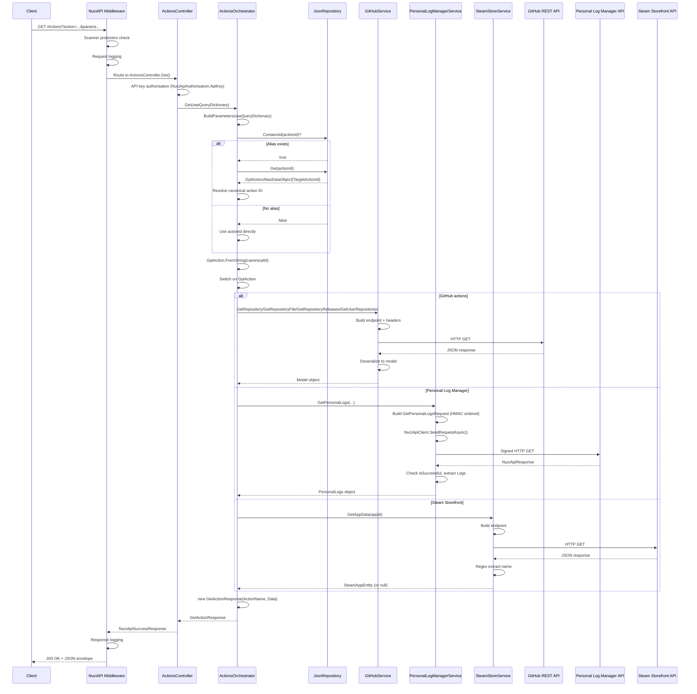
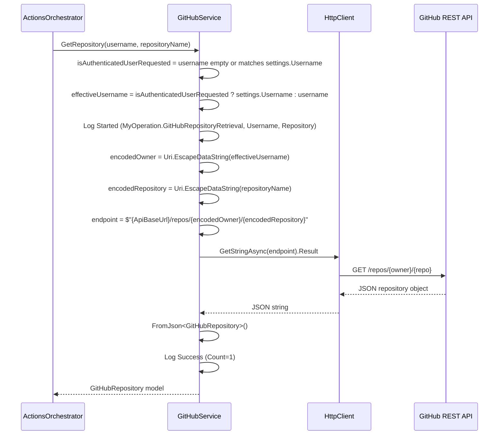
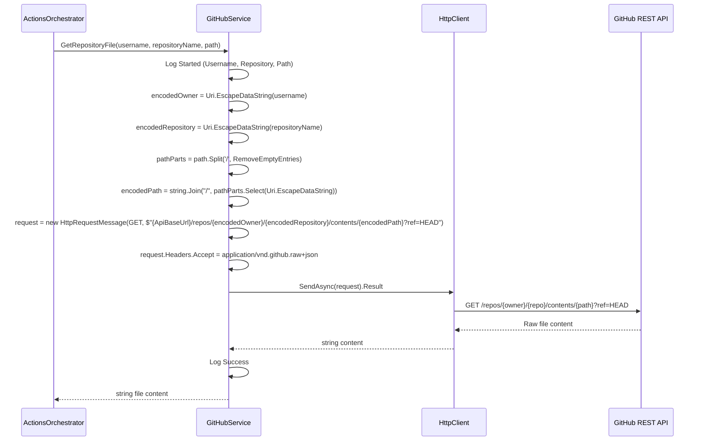
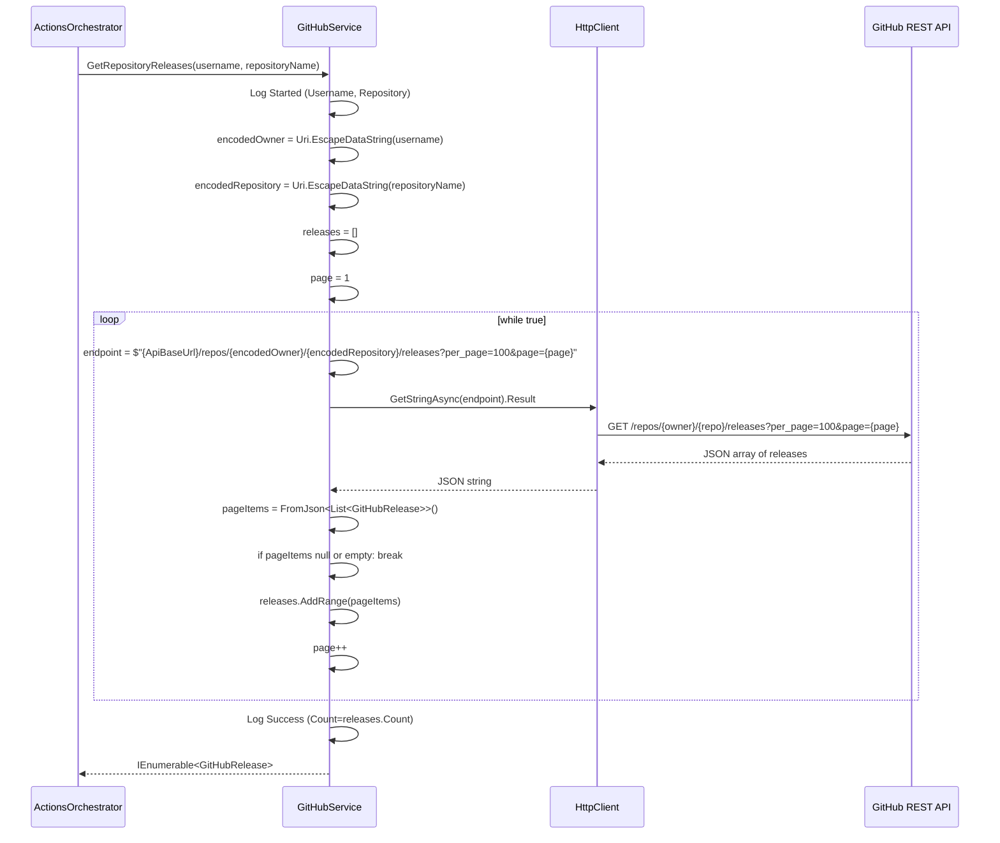
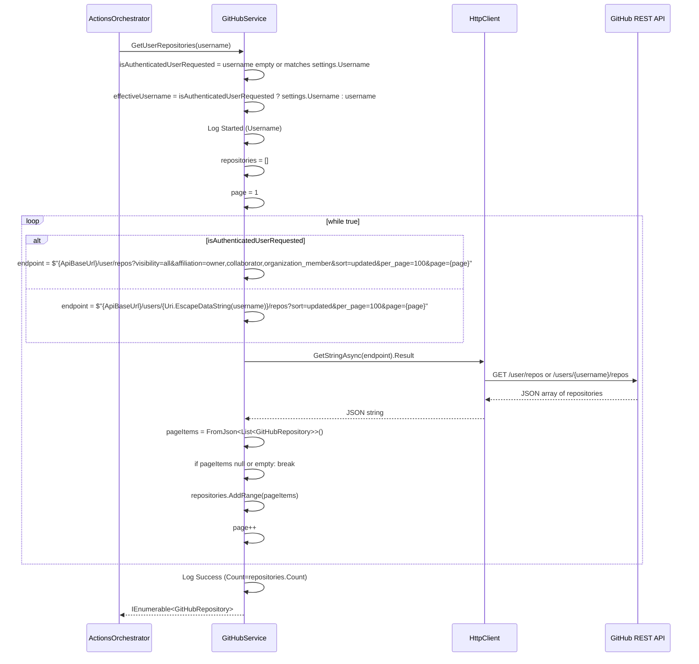
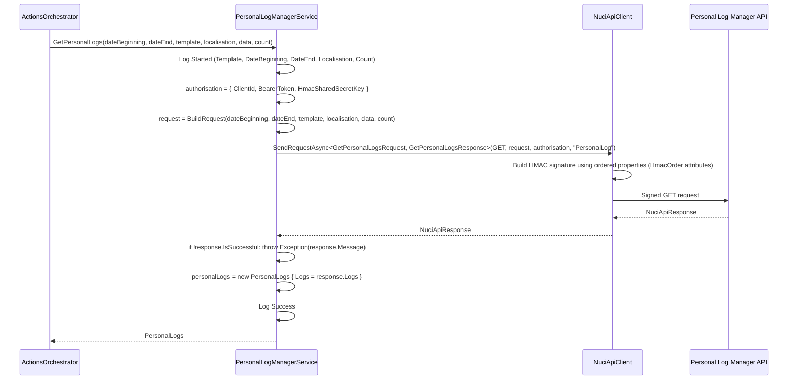
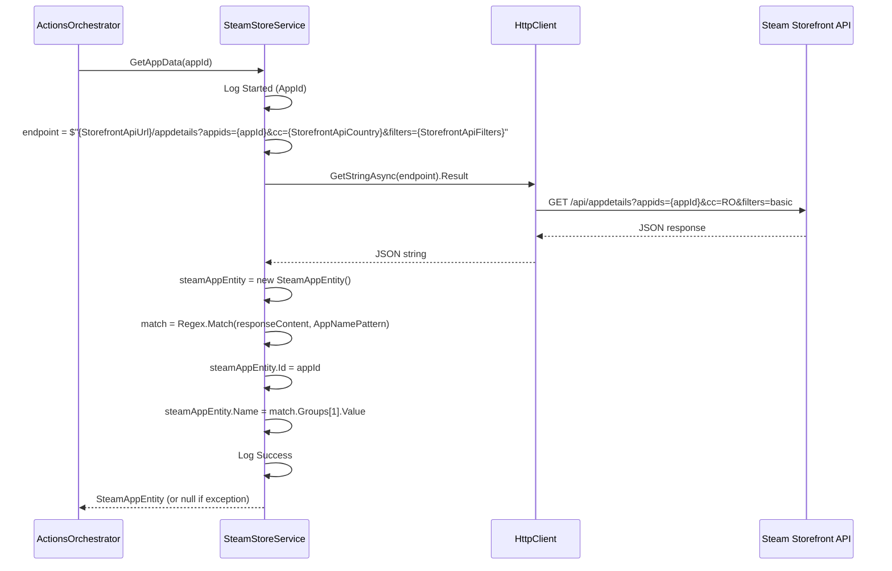
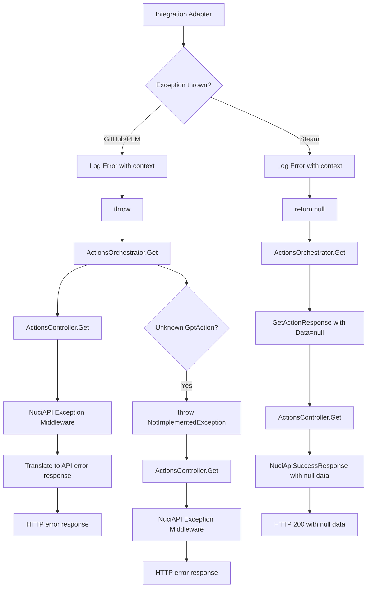
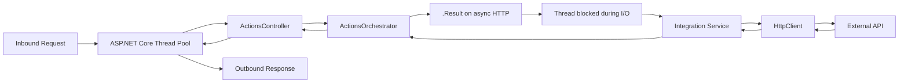

# Runtime Execution Flows

This document provides detailed causal execution traces for each action type, showing the complete path from inbound request to outbound response.

## Inbound Get Action Flow (Complete)



## Parameter Building Flow

```mermaid
flowchart TD
    RawParams[Dictionary<string,string> rawParameters] --> Loop{For each key,value}
    Loop --> HasDot{key.Contains('.')?}
    HasDot -->|Yes| Split[Split on first '.' into parentKey, childKey]
    Split --> ParentExists{parameters.ContainsKey(parentKey)?}
    ParentExists -->|No| CreateDict[parameters[parentKey] = new Dictionary<string,string>()]
    ParentExists -->|Yes| AddChild[parameters[parentKey][childKey] = value]
    CreateDict --> AddChild
    AddChild --> Loop
    HasDot -->|No| AddScalar[parameters[key] = value]
    AddScalar --> Loop
    Loop -->|Done| Result[Dictionary<string,object> parameters]
```

**Example transformation:**
```
Input:  { "action": "GetPersonalLogs", "data.mood": "happy", "data.energy": "high" }
Output: { "action": "GetPersonalLogs", "data": { "mood": "happy", "energy": "high" } }
```

## Alias Resolution Flow

```mermaid
flowchart TD
    ActionId[action parameter value] --> ContainsCheck{aliasesRepository.ContainsId(ActionId)?}
    ContainsCheck -->|Yes| GetAlias[aliasesRepository.Get(ActionId)]
    GetAlias --> TargetId[alias.TargetActionId]
    TargetId --> FromString[GptAction.FromString(TargetId)]
    ContainsCheck -->|No| DirectResolve[GptAction.FromString(ActionId)]
    FromString --> Resolved[GptAction instance]
    DirectResolve --> Resolved
    Resolved --> Dispatch{Switch on GptAction}
```

**Alias file structure** (`Data/gpt-action-aliases.json`):
```json
[
  { "id": "github.file.get", "targetActionId": "github.repository.file.get" },
  { "id": "github.repo.get", "targetActionId": "github.repository.get" },
  { "id": "personal.logs.get", "targetActionId": "personallogmanager.logs.get" }
]
```

## GitHub Repository Retrieval Flow



**Key implementation details:**
- `ApiBaseUrl = "https://api.github.com"`
- `ApiVersion = "2022-11-28"` (sent as `X-GitHub-Api-Version` header)
- Accept header: `application/vnd.github+json`
- Optional Bearer auth from `GitHubSettings.ApiKey`
- Pagination for user repositories and releases (100 per page)

## GitHub Repository File Retrieval Flow



**Note:** Uses `application/vnd.github.raw+json` Accept header to get raw file content directly.

## GitHub Repository Releases Retrieval Flow



## GitHub User Repositories Retrieval Flow



## Personal Log Manager Retrieval Flow



### BuildRequest Details

```mermaid
flowchart TD
    Input[dateBeginning, dateEnd, template, localisation, data, count] --> DateRegex[BuildDateRangeRegex]
    DateRegex --> RegexResult{dateBeginning && dateEnd both provided?}
    RegexResult -->|Both empty| ReturnNull[return null]
    RegexResult -->|One empty| ThrowArgEx[throw ArgumentException]
    RegexResult -->|Both provided| ParseDates[Parse as DateOnly yyyy-MM-dd]
    ParseDates --> ValidateOrder{end >= start?}
    ValidateOrder -->|No| ThrowArgEx2[throw ArgumentException]
    ValidateOrder -->|Yes| BuildList[Generate list of dates from start to end]
    BuildList --> JoinRegex[return "(" + string.Join("|", dates) + ")"]
    JoinRegex --> Request[GetPersonalLogsRequest]
    Request --> SetDate[request.Date = regexResult]
    Request --> SetTemplate[request.Template = template]
    Request --> SetLocalisation{localisation empty?}
    SetLocalisation -->|Yes| DefaultLoc[request.Localisation = "ro"]
    SetLocalisation -->|No| UseLoc[request.Localisation = localisation]
    Request --> SetData[request.Data = data]
    Request --> SetCount{count empty?}
    SetCount -->|Yes| DefaultCount[request.Count = 1000]
    SetCount -->|No| ParseCount[request.Count = int.Parse(count)]
    DefaultCount --> Return[return request]
    UseLoc --> Return
    ParseCount --> Return
    DefaultLoc --> Return
```

**HMAC property order** (from `GetPersonalLogsRequest`):
1. `Date` (HmacOrder=1)
2. `Time` (HmacOrder=2) — not set by orchestrator
3. `Template` (HmacOrder=3)
4. `Localisation` (HmacOrder=4)
5. `Data` (HmacOrder=5)
6. `Count` (HmacOrder=6)

## Steam Storefront App Data Retrieval Flow



**Constants:**
- `StorefrontApiUrl = "http://store.steampowered.com/api"`
- `StorefrontApiCountry = "RO"`
- `StorefrontApiFilters = "basic"`
- `AppNamePattern = "\"name\": *\"([^\"]*)\""`

**Failure semantics:** Catches all exceptions, logs error, returns `null` (does not rethrow)

## Response Construction Flow

```mermaid
flowchart TD
    Orchestrator[ActionsOrchestrator.Get] --> ActionResolved[GptAction resolved]
    ActionResolved --> Dispatch[Switch on GptAction]
    Dispatch --> AdapterCall[Call integration service]
    AdapterCall --> AdapterResult[object data]
    AdapterResult --> BuildResponse[new GetActionResponse]
    BuildResponse --> SetActionName[GptActionName = action.ToString()]
    BuildResponse --> SetData[Data = data]
    BuildResponse --> Return[return GetActionResponse]
    Return --> Controller[ActionsController.Get]
    Controller --> ProcessRequest[ProcessRequest with authorisation]
    ProcessRequest --> NuciApiSuccessResponse[NuciApiSuccessResponse envelope]
    NuciApiSuccessResponse --> Serialization[JSON serialisation]
    Serialization --> Client[HTTP 200 response]
```

**Response envelope** (via `NuciApiSuccessResponse`):
```json
{
  "success": true,
  "action": "GetGitHubRepository",
  "data": { ...provider-specific payload... }
}
```

## Error Propagation Flow



## Concurrency and Resource Flow



**Implication:** Each request thread remains occupied during outbound I/O. Throughput constrained by thread pool size and external API latency.

## Related Documentation

- [Architecture Overview](architecture-overview.md) — high-level context
- [Orchestration Engine](orchestration-engine.md) — dispatch logic detail
- [Integration Adapters](integration-adapters.md) — adapter implementations
- [Error Handling](error-handling.md) — exception semantics
- [Component Reference](component-reference.md) — component details